# Building the SugboDoc Assistant — Chatbot Development Flowchart

A build plan for a **documentation support chatbot** that answers user questions strictly
from the product docs. When it *can't* answer, it captures that failure and turns it into
either a **Jira ticket** (on the user's say-so) or a **docs-update task** — so the knowledge
base gets better over time.

## The data flow in one picture

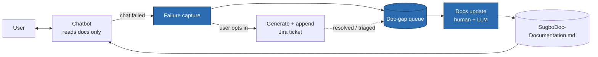

**Jira is outbound only.** The bot never retrieves tickets. The only thing it reads is
`SugboDoc-Documentation.md`.

Two constraints drive every choice:

1. **Highlight real data science skill — but stay honest.** No classical technique used just
   to show theory when a simpler or better modern tool wins. Section 8 lists what was
   deliberately *not* used and why.
2. **Minimal / zero cost.** The LLM is **Google Gemini** on the free tier (answers, the
   verification pass, triage, ticket drafts, the eval judge, and embeddings). Jira's REST
   API is free with any account and is called only when a ticket is actually submitted.
   *Trade-off:* the free tier caps daily requests per model — the batch jobs (eval, cluster,
   docs loop) stop cleanly on a `QuotaError` and are meant to run in small passes or with
   billing enabled. Swapping in local Ollama is a one-file change in `llm.py`.

> **As built:** this document is the design rationale. Section 12 maps every stage below to
> the module that implements it, with the command to run it.

---

## 0. Architecture decision — the docs fit in context, so there is no retrieval

`SugboDoc-Documentation.md` is ~8k tokens. Any local model worth using has an 8k+ context
window. So the whole doc goes in the prompt, every turn. **No chunking, no embeddings, no
vector store, no RAG** — until the docs grow past roughly a quarter of the model's context
budget.

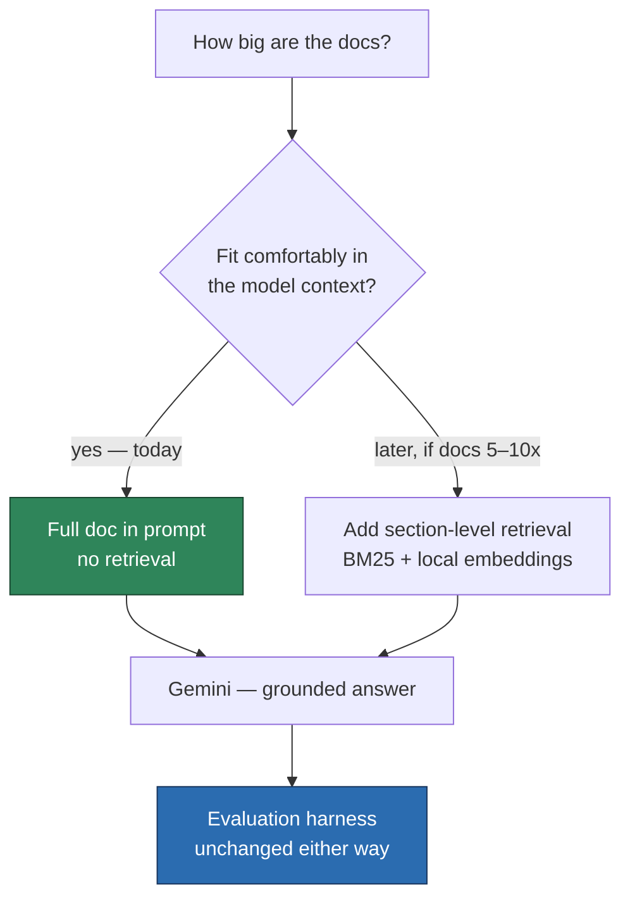

The data science in this project is **not** in the retrieval stack. It's in (a) detecting
when a chat failed, (b) generating a useful ticket, and (c) mining failures to prioritise
doc work. Those are §2, §3, §6, §7.

---

## 1. Inference path (per turn) — deliberately simple

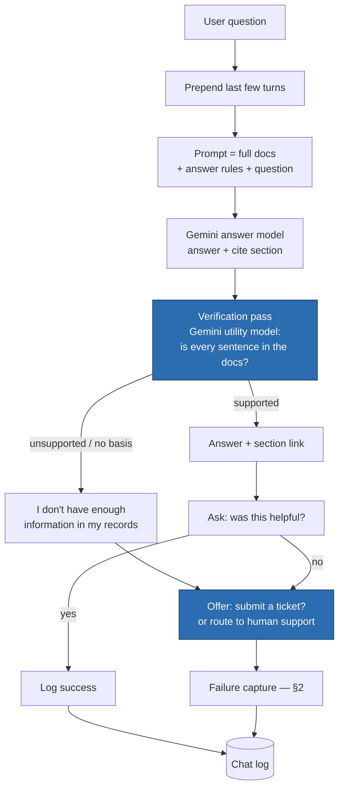

**Why a separate verification pass** — small local models are weak at self-policing "I don't
know". A second, independent Gemini call that checks the draft answer against the docs catches
hallucinations a frontier model would catch inline. Tune its strictness on the eval set (§6). Implemented in `grounding.py`.

**Data science work here**

- The grounding/refusal rubric and few-shot refusal examples in the prompt
- Verification-pass threshold tuning (precision/recall of "this answer is unsupported")
- Latency profiling — two local calls per turn on CPU can be slow

---

## 2. Failure capture — when did the chat fail, and what do we do with it?

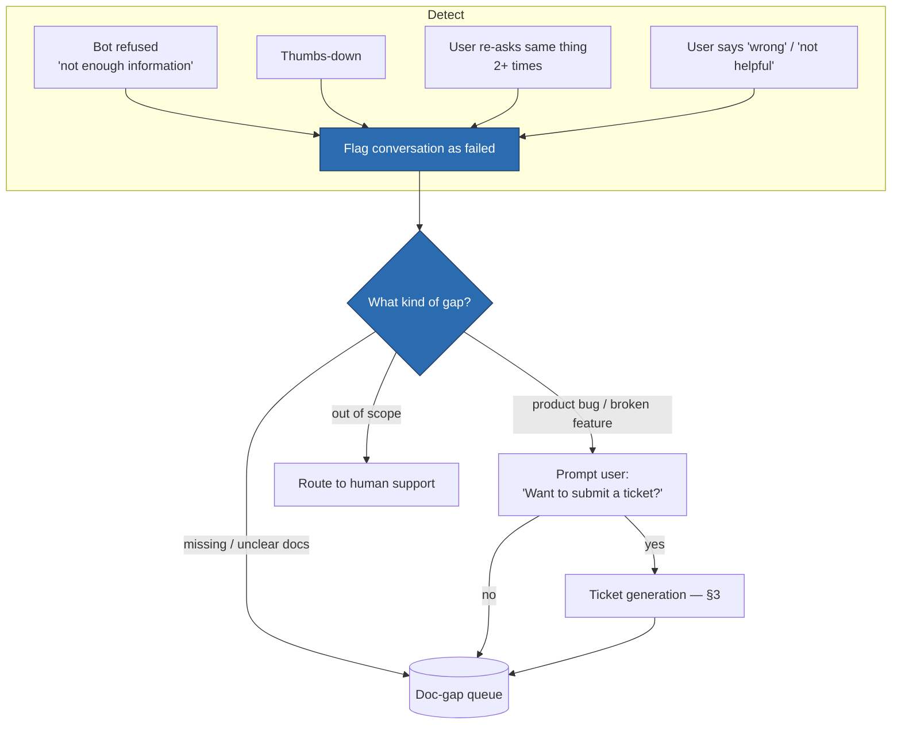

**Detection: rules first, model later.** The two strong signals — the bot's own refusal and
a thumbs-down — need no ML and cover most cases. Add the softer signals (repeated re-asking,
negative follow-up) as rules too. Only train a dissatisfaction classifier once the logs have
a few hundred labelled conversations *and* the rules are visibly missing failures.

**Triage** is a single Gemini call ("is this a docs gap, a product bug, or out of
scope?") over the conversation — measured on the eval set like everything else. Every failed
chat lands in the doc-gap queue regardless; the ticket is an extra branch.

**Data science work here**

- Failure-signal design and precision/recall of each signal against human-labelled chats
- Triage classification quality (confusion matrix: docs-gap vs bug vs out-of-scope)
- Deciding when the rules stop being enough (missed-failure rate over time)

---

## 3. Ticket generation & Jira append (only on user confirmation)

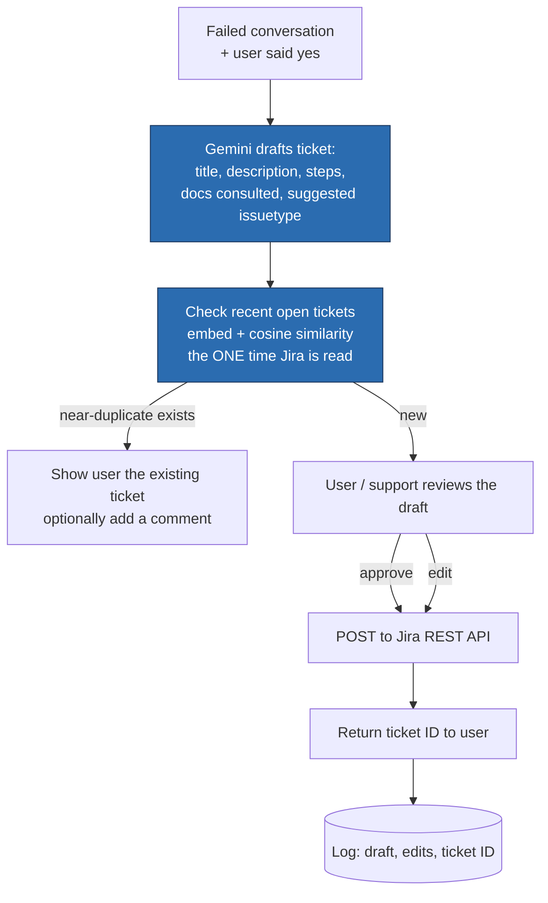

**The dedup step is the only Jira read in the whole system** — and it's per *submission*,
not per request. Pull the last ~100 open tickets, embed their summaries, compare to the
draft. Stops the queue filling with ten copies of the same bug.

**Data science work here**

- Ticket-draft quality: track **human edit distance** and **acceptance rate** — is the LLM
  draft good enough to approve with minor edits? This is a measurable generation-quality metric.
- Duplicate-detection threshold tuning (precision/recall of "this is a dup")
- Suggested-issuetype accuracy vs. what the reviewer picks

---

## 4. Docs maintenance loop — "every time I want to update the docs"

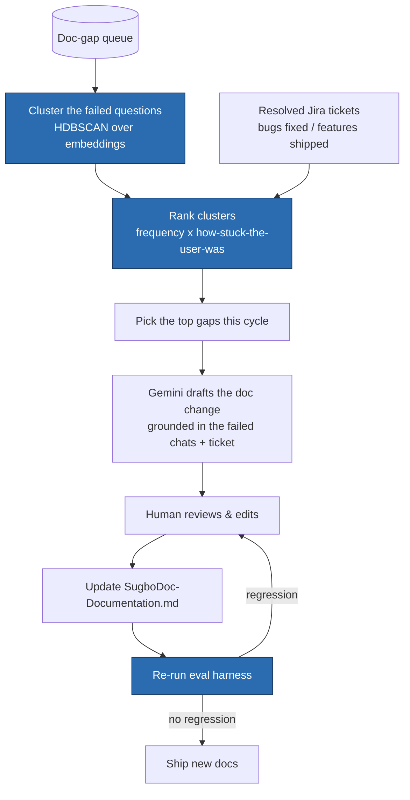

This runs on your schedule — weekly, or whenever the queue is worth a pass. Resolved Jira
tickets feed in here (a fixed bug or shipped feature often means a doc is now wrong), which
is the *indirect* path from Jira back to the bot: **Jira → docs → bot**, never Jira → bot.

**Data science work here**

- Clustering failed questions, labelling clusters, ranking by impact
- For each doc change: add a matching eval case *before* merging, so the fix is verified
- Regression tracking — the frozen scorecard re-run on every docs edit

---

## 5. Docs preparation (one-time, already mostly done)

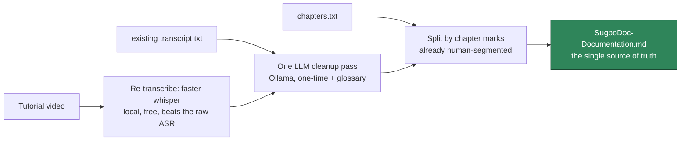

`chapters.txt` is already a human topic segmentation; the curated markdown is the KB. No
spell-correction pipeline, no TextTiling — see §8.

---

## 6. Evaluation harness — the data science centrepiece

Nothing here is at risk of being "outperformed by another tech" — measurement is what tells
you which tech wins.

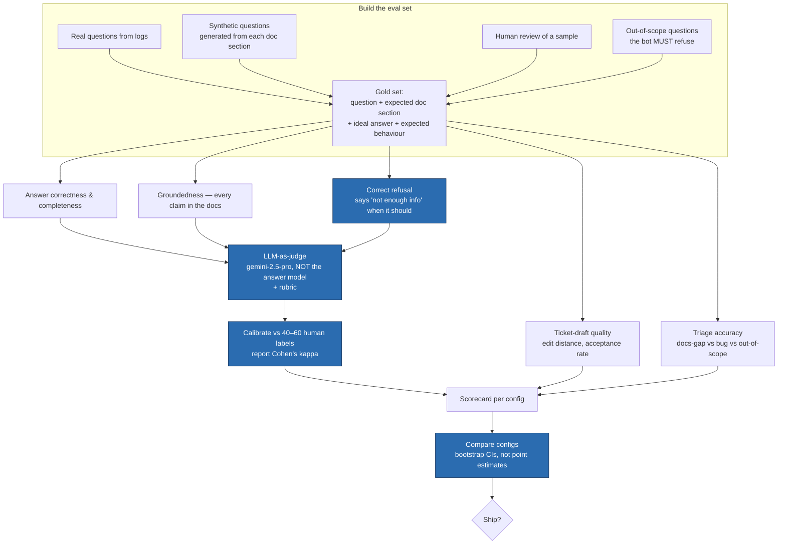

**Data science skills exercised**

- Eval-set design, including a **dedicated "must refuse" slice** — the hallucination guard
  is only as good as its test set
- Generation-quality metrics that aren't just vibes: **ticket-draft edit distance and
  acceptance rate**, refusal precision/recall
- LLM-as-judge done properly — rubric, calibration against human labels, Cohen's κ. Use a **different, stronger** model than the answer model for judging (here `gemini-2.5-pro` judging a `gemini-3.6-flash` answerer); keep a fixed 40–60 question human panel per release and report Cohen's κ
- Config comparison with **bootstrap confidence intervals**; multiple-comparison awareness
- Frozen scorecard re-run on every prompt / docs change

**Zero cost:** the custom harness in `eval_run.py` (deterministic checks + LLM-judge +
bootstrap CIs + `--calibrate` for Cohen's κ); human labels in a CSV.

---

## 7. Analytics — mine the failures

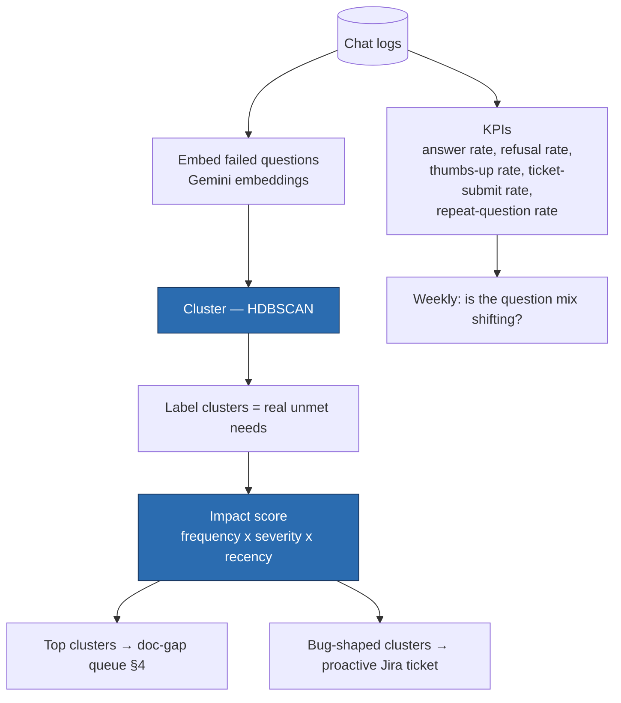

Clustering real failed questions is the best way to see *what users actually can't get
answered* and where to spend doc effort. Cheap, unsupervised, not replaced by anything
better.

**Data science skills** — embedding + density clustering, cluster labelling, impact
scoring, coverage-gap analysis, drift checks, product analytics (answer rate, containment,
repeat-question rate).

---

## 8. Techniques deliberately NOT used (and why)

| Not used | Textbook reason to use it | Why it loses here |
|---|---|---|
| **Per-request Jira retrieval / RAG over tickets** | "Feed operational context into every answer" | The bot answers from docs; tickets are a *write* target. Reading tickets per turn adds latency, a sync pipeline, and stale-status risk for zero benefit. Jira reaches the bot only via **Jira → docs → bot**. |
| Vector DB for the docs (today) | "RAG needs embeddings" | Docs are ~8k tokens — the whole thing fits in the prompt. Retrieval only adds a missed-chunk failure mode. Revisit at ~5–10× the size. |
| Dissatisfaction / sentiment classifier (day one) | Detect failed chats | The bot's own refusal + a thumbs-down button catch most failures with zero ML. Train a classifier only once rules are demonstrably missing failures. |
| Classifier for suggested Jira issue type | Auto-file with the right type | Let the LLM suggest it in the draft; the reviewer corrects it. Track accuracy, don't train a model for a field a human approves anyway. |
| Cross-encoder reranker | Best-in-class reranking | Nothing to rerank — no retrieval in the inference path. |
| TextTiling / embedding topic segmentation | Automatic passage boundaries | `chapters.txt` is already a human segmentation. |
| SymSpell / Levenshtein + seq2seq punctuation restoration | Clean noisy ASR | Re-running Whisper fixes it at the source; one LLM pass handles the rest. |
| NLI entailment model for groundedness | Verify answers are supported | A rubric-based Ollama verification pass is simpler and reuses infra you already have. |
| Fine-tuning / LoRA the local model | Better grounding on your domain | No labelled data yet; hardened prompt + verification pass + tight scope get you further first. Revisit once §7 has produced a few hundred graded answers. |

---

## 9. Zero-cost / local stack

| Layer | Free choice | Note |
|---|---|---|
| Glue / notebooks | Python, `pandas`, `scikit-learn` | — |
| Generation LLM | **Ollama** — small model (~3–4B) for verification + triage, mid model (~8–14B) for answers & ticket drafts | `ollama serve`; keep both pulled |
| LLM-as-judge | **Ollama** — largest model your hardware runs, different from the answer model | expect a weaker judge; keep a human panel |
| Embeddings (dedup + clustering) | Ollama (`nomic-embed-text`) or `sentence-transformers` (`bge-small-en`) | CPU-fine; used offline, not per turn |
| Jira write | Jira Cloud REST API + `requests` | free with any account; called only on ticket submit |
| Re-transcription | `faster-whisper` | one-time, CPU-fine for a ~1 h video |
| NLP | `spaCy`, `nltk` | glossary mining, PII redaction |
| Clustering / analytics | `hdbscan`, `umap-learn` | the failure-mining loop |
| Eval | `promptfoo` (native Ollama provider) or a small custom harness | — |
| Serving | FastAPI + Ollama on one host | chat data stays local |
| Experiment tracking | git + the markdown scorecard; local `mlflow` if you want a UI | — |
| Hardware | ~16 GB RAM for a 14B model at Q4; GPU optional | the one real cost of this path |

---

## 10. Milestone sequence

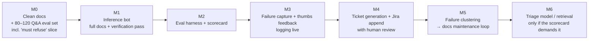

Ship a measurable baseline at **M1**; stand up evaluation at **M2** before anything else —
every later change is judged against the frozen scorecard.

---

## 11. Skills-to-stage map

| Stage | Data science competency on display |
|---|---|
| §0 architecture choice | Recognising the docs fit in context — knowing when retrieval is premature |
| §2 failure capture | Failure-signal design, precision/recall per signal, triage classification, knowing when rules beat a model |
| §3 ticket generation | Generation-quality metrics (edit distance, acceptance rate), embedding dedup, threshold tuning |
| §4 docs maintenance | Failure clustering, impact ranking, eval-case-before-merge discipline, regression tracking |
| §6 evaluation | Eval-set design (incl. refusal slice), LLM-judge calibration (κ) with a local judge, bootstrap inference, frozen scorecard |
| §7 analytics | Embedding clustering (HDBSCAN), impact scoring, coverage-gap analysis, drift checks, product analytics |
| §1 inference | Prompt/rubric design measured against eval, verification-pass tuning to compensate for a weaker base model |
| §8 scoping | Judgement about what to leave out — *no per-request Jira retrieval, no vector DB, no classifier for data a human approves* |

The strongest signal is §6 and §8: a rigorous evaluation harness, and the discipline to keep
the inference path trivial and put the intelligence into the feedback loop that improves the
docs.

---

## 12. As built — file map

Every stage above is implemented. Flat module layout so imports "just work" on Windows.
**`PROJECT.md` is the detailed walkthrough** (every file + key functions); this is the index.

### Core library (imported by everything)

| File | Responsibility | Stage |
|---|---|---|
| `config.py` | Paths, model names, thresholds, backend switches, one-time `.env` load | — |
| `llm.py` | The one model interface: `generate`, `new_chat`/`Chat.send`, `embed`; SQLite response cache; offline mode; quota-aware `retry` + `QuotaError` | — |
| `_gemini_backend.py` | Real Gemini SDK calls (lazy-imported by `llm.py`) | — |
| `_mock_backend.py` | Offline deterministic stand-in — no API key / quota | — |
| `knowledge.py` | Load docs, split into 60+ `Section`s, assemble the system prompt | §0, §5 |
| `bot.py` | `respond()` — the one answer path: answer model → verification → refuse-or-answer | §1 |
| `grounding.py` | The verification pass (`verify()` → `GroundingVerdict`) | §1 |
| `failure_capture.py` | Rule-based `detect_failures()` + model `triage()` | §2 |
| `ticketing.py` | `draft_ticket()` — conversation → `{subject, category, summary}` | §3 |
| `jira_client.py` | Outbound `create_issue()`; batch reads `list_recent_open_issues` / `list_resolved_issues` | §3, §4 |
| `jira_dedup.py` | `find_duplicate()` — embed draft vs open tickets, cosine (the one Jira read) | §3 |
| `chatlog.py` | Append/load `logs/chats.jsonl` — one record per finished conversation | feeds §6, §7 |
| `engine.py` | UI-independent conversation state machine (`chat → feedback → offer_ticket → done`) | §1–§3 |
| `cli.py` | Shared `--mock` / `--offline` / `--no-cache` flags for the batch scripts | — |

### Entry points

| Command | What it does | Stage |
|---|---|---|
| `streamlit run app.py` | Streamlit demo UI: full inference path + feedback loop + modal ticket flow + logging | §1–§3 |
| `uvicorn service:app` | FastAPI backend (JSON API + bundled `web/index.html` widget) — the "ship to a website" path | §1–§3 |
| `python eval_run.py` | Run the pipeline over `eval_set.jsonl`, LLM-judge, write `eval_scorecard.md/.json` (bootstrap CIs). `--calibrate` → Cohen's κ; `--no-judge` / `--mock` / `--offline` | §6 |
| `python eval_gen.py` | Draft synthetic eval questions from each doc section → `eval_generated.jsonl` (review before merging) | §6 |
| `python analytics_kpis.py` | Containment / thumbs / refusal / repeat-question KPIs from the log (no model calls) | §7 |
| `python analytics_cluster.py` | Embed failed questions → HDBSCAN → label → impact score → `logs/doc_gap_queue.json` | §7 |
| `python docs_loop.py` | Top gaps + resolved Jira → model drafts a doc change → `doc_proposals/` | §4 |
| `python seed_demo_log.py` | Write synthetic conversations so the analytics/loop scripts are demoable with no traffic | — |
| `python llm_cache.py` | Inspect / `--clear` the response cache | — |
| `python jira_check.py` | Standalone connectivity + createmeta field check (`--create-test` files a throwaway) | setup |
| `pytest` | 40 offline tests (mock backend, tmp paths) | — |

### Data files

| File | Tracked? | Notes |
|---|---|---|
| `SugboDoc-Documentation.md` | gitignored | the single source of truth |
| `system-prompt.md` | gitignored | original prompt (see note below) |
| `eval_set.jsonl` | yes | 90 hand-authored cases; 61 answerable + 29 must-refuse |
| `eval_scorecard.md` | yes | committed baseline — diff it on every prompt/docs change (marks the backend; a `mock` card is a plumbing check, not a score) |
| `eval_scorecard.json` | gitignored | machine-readable scorecard + per-case detail |
| `web/index.html` | yes | the demo chat widget `service.py` serves |
| `logs/chats.jsonl` | gitignored | append-only conversation log |
| `logs/llm_cache.sqlite` | gitignored | response cache (warm it once, then `--offline`) |
| `logs/doc_gap_queue.json` | gitignored | impact-ranked output of `analytics_cluster.py` |
| `doc_proposals/*.md` | gitignored | draft doc changes for human review |

### The loop, end to end

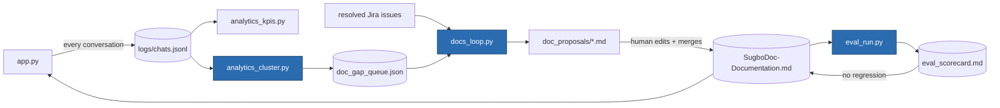

### First run

```
pip install -r requirements-dev.txt
pytest                              # 40 offline tests (~1s)

cp .env.example .env                # add GEMINI_API_KEY (+ JIRA_* for ticketing)
streamlit run app.py               #  or:  LLM_BACKEND=mock streamlit run app.py

# offline demo of the maintenance side (no API needed with --mock):
python seed_demo_log.py
python analytics_kpis.py
python analytics_cluster.py --mock
python docs_loop.py --mock

# the JSON backend for embedding in a website:
pip install -r requirements-service.txt
uvicorn service:app --reload        #  http://127.0.0.1:8000
```

**Free-tier note:** Gemini caps requests/day per model. `eval_run.py` is ~2 calls/case
(≈180 for the full 90-case set); run it with `--limit`, `--no-judge`, enable billing, or
point `GEMINI_MODEL` / `GEMINI_JUDGE_MODEL` at models that still have quota. Every response
is cached to `logs/llm_cache.sqlite`, so a second run of the same config is free — and
`--offline` will then serve entirely from that cache. Every batch script stops cleanly on
`QuotaError` (the eval writes a partial scorecard). `--mock` skips the API entirely.

---

## Note on `system-prompt.md`

The prompt you saved has an **"Operational Awareness (Jira Integration)"** clause that
assumes retrieved Jira tickets appear in `<retrieved_context>`. Under this architecture the
bot never sees tickets, so that clause is dead weight — it can be dropped, and the
`<retrieved_context>` block simplifies to doc passages only. Say the word and I'll trim it.
